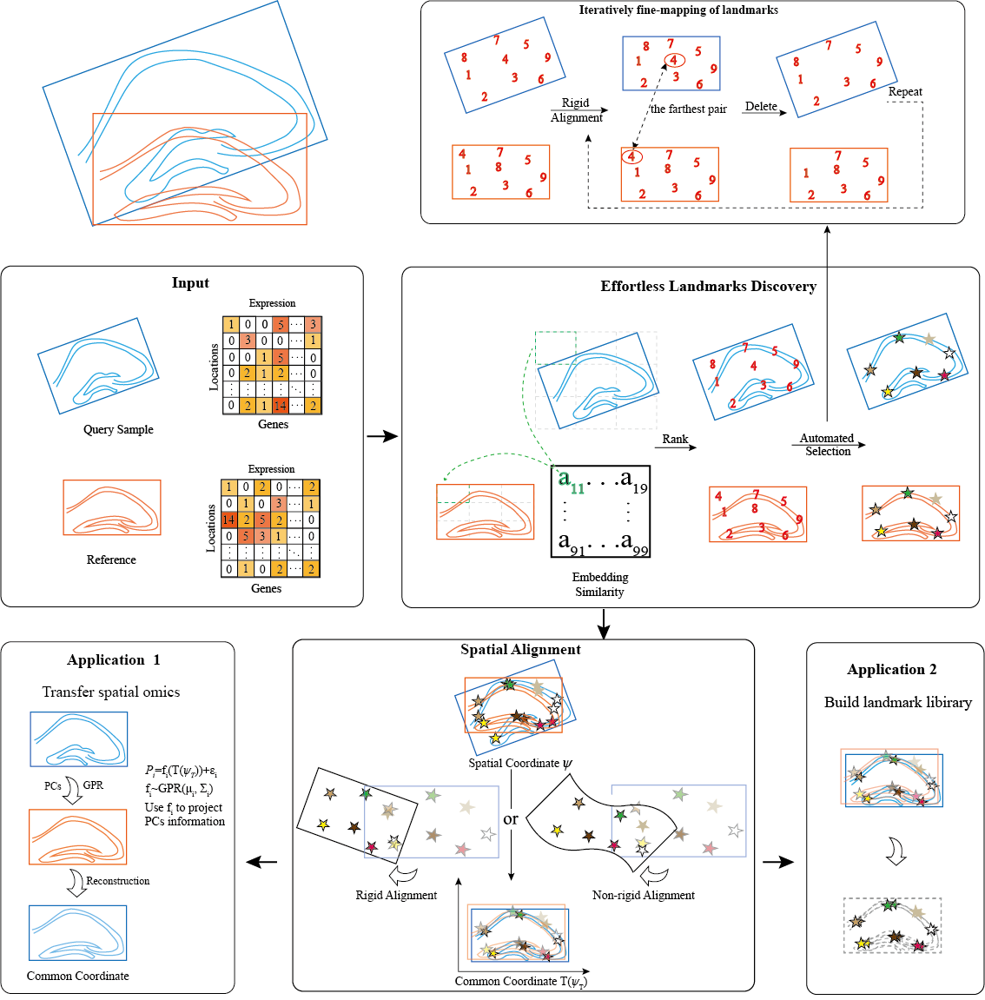

Welcome to ARIEL’s documentation!
=======================================

We develop a fast, omics-driven sample integration tool called ARIEL, which enables effortless landmark detection, spatial alignment and information transfer for multi-sample spatial transcriptomic data. ARIEL can be applied in diverse situation, including cross-individual, cross-platform, cross-resolution, cross-omics, and cross-disease scenarios. The main program of ARIEL can be summarized in the figure:

.. toctree::
   :maxdepth: 2
   :caption: Contents:

   readme.ipynb
   brain.ipynb
   DLPFC(Alignment).ipynb
   hepatic lobule.ipynb
   hippocampus.ipynb

End
=======================================